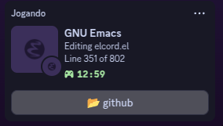

# elcord-enhanced ✨

[](https://opensource.org/licenses/MIT)

Enhanced Discord Rich Presence integration for Emacs with modern visuals and deeper customization.



## ✨ Features

- **Rich Editor Presence**:
  - Displays current file/buffer
  - Shows major mode with custom icons
  - Tracks cursor position
  - Configurable line number display

- **Enhanced Customization**:
  - Modern icon sets
  - Switch small and large icon
  - Flexible button configuration with `:label` and `:url` keywords (up to 2 external links)

## 🚀 Installation

### Recommended Method (straight.el)

```elisp
(straight-use-package
 '(elcord :type git :host github :repo "robert-nogueira/elcord-enhanced"
          :files ("*.el" "*.ps1" "images/*")))
```

### Alternative Methods

<details> <summary>Manual Installation</summary>

    Clone the repository:
    bash

git clone https://github.com/robert-nogueira/elcord-enhanced.git ~/.emacs.d/elcord-enhanced

Add to your init file:
elisp

    (add-to-list 'load-path "~/.emacs.d/elcord-enhanced")
    (require 'elcord)

</details>

## ⚙️ Basic Configuration
```elisp
(use-package elcord
  :straight t
  :config
  (setq elcord-refresh-rate 15)          ; Update frequency in seconds
  (setq elcord-display-buffer-details t) ; Show buffer info

  ;; Visual customization
  (setq elcord-editor-icon "doom")      ; Editor icon theme
  (setq elcord-use-major-mode-as-main-icon t) ; Use language icons as main

  ;; Rich presence buttons (max 2)
  (setq elcord-buttons '((:label "📂 GitHub"
                         :url "https://github.com/robert-nogueira")
                         (:label "🌟 My Dotfiles"
                         :url "https://github.com/me/dotfiles")))

  (elcord-mode))  ; Enable the mode
```

## ❓ Frequently Asked Questions
Why don't my buttons appear in Discord?

    Ensure you're using the official Discord client (not web version)
    Check that "Display current activity" is enabled in Discord settings
    Buttons may not show on mobile devices

How can I add custom icons?

    Host your icons online (GitHub repo recommended)
    Add mappings to elcord-mode-icon-alist
    Set elcord-icon-base to your icons' base URL

## 🤝 Contributing

### We welcome contributions! Please:

    Fork the repository

    Create a feature branch

    Submit a pull request

### Guidelines:

    Maintain backward compatibility

    Follow existing code style

    Document new features

## 📜 License

MIT License
